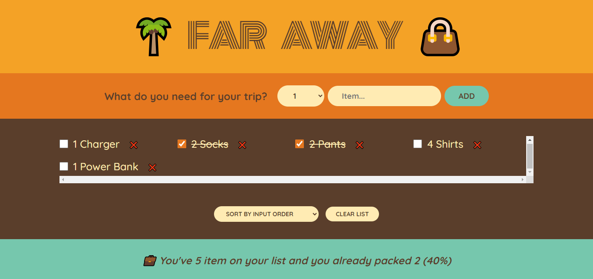

# Introduction

This project is part of a course "The Ultimate React Course 2024: React, Redux & More" by Jonas Schmedtmann. This is a travel list app, where we can check if packed our necessary things before travel or not.

### Screenshot of app

### Links

- [Live](https://travel-list-rahidt.netlify.app/)

## Author

- LinkedIn - [@rahidt](https://www.linkedin.com/in/rahidt/)

## Available Scripts

In the project directory, you can run:

### `npm start`

Runs the app in the development mode.

### `npm test`

Launches the test runner in the interactive watch mode.

### `npm run build`

Builds the app for production to the `build` folder.
